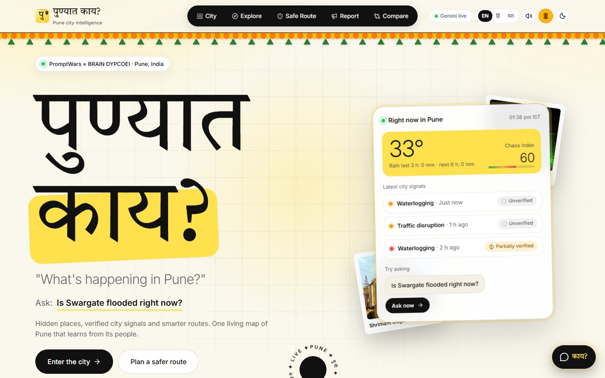
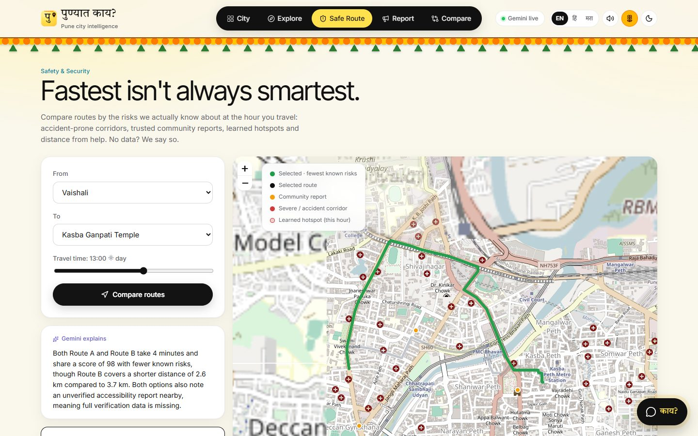
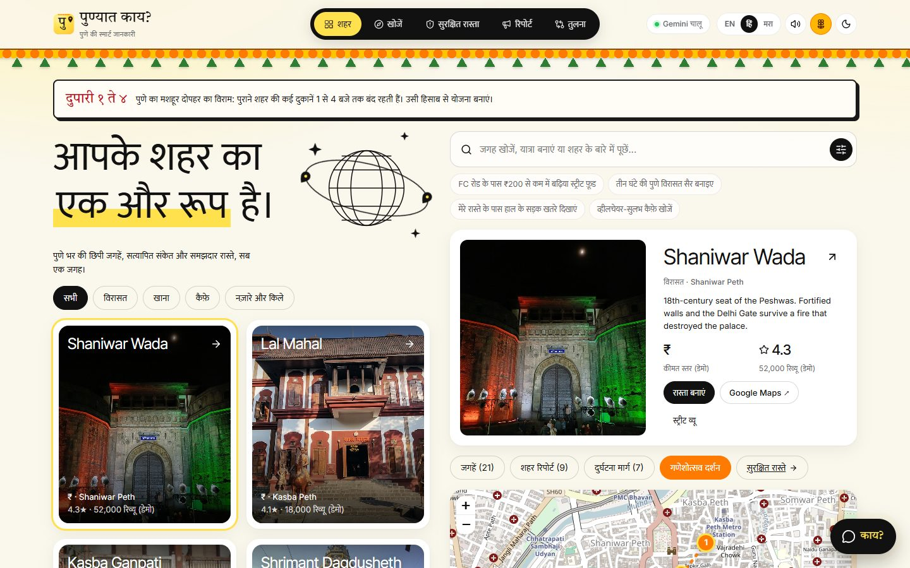
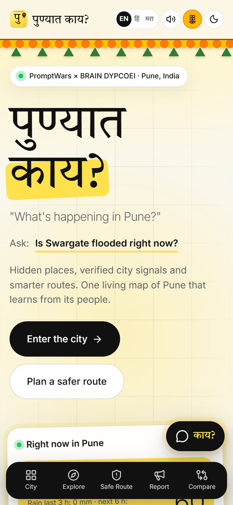
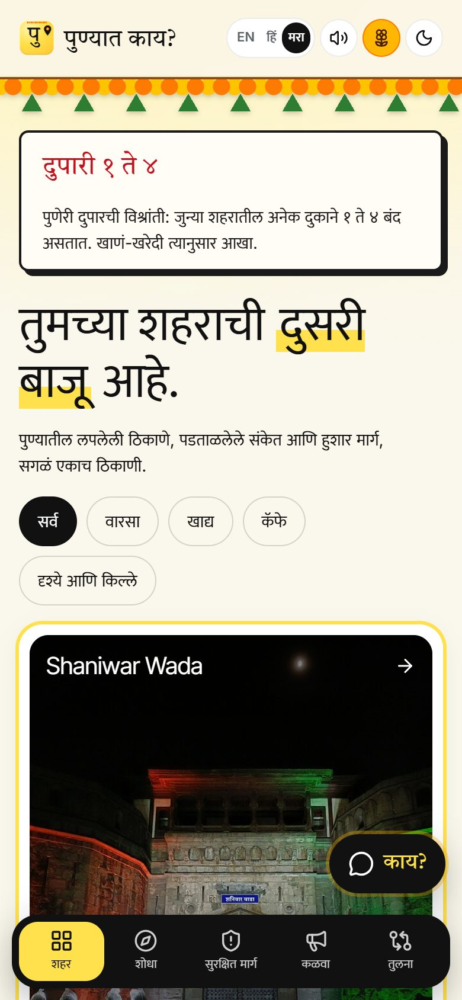
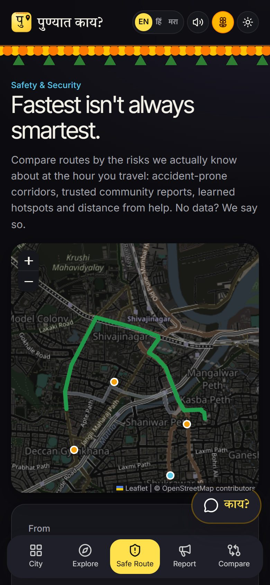
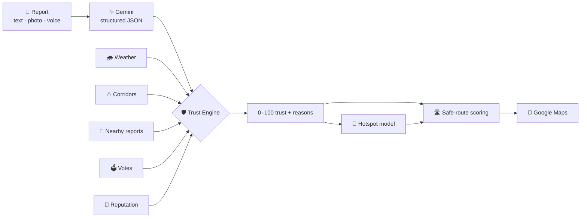
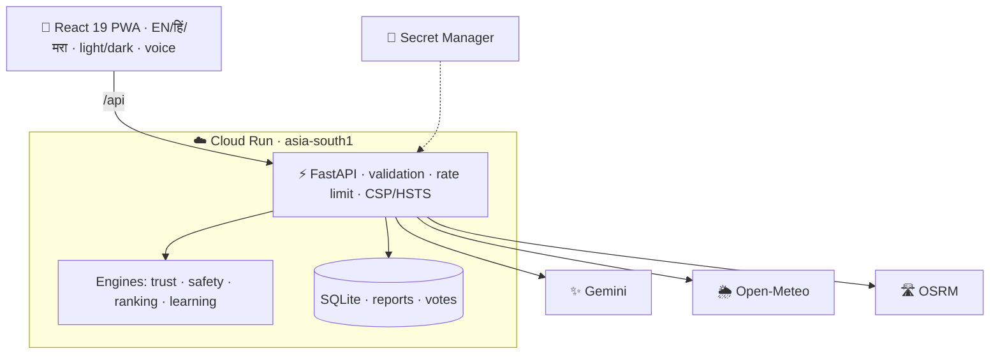

<div align="center">


# पुण्यात काय?

### *"What's happening in Pune?"*

**Hidden places · verified city signals · smarter routes**: one living map of Pune that **learns from its people**.

[](https://punyat-kay-knd5p2vgxa-el.a.run.app)
[](https://github.com/SarthakKandhare03/PromptWarsDYP/actions/workflows/ci.yml)


**PromptWars × BRAIN DYPCOEI · Problem statement: *City Life: Exploring, Experiencing & Navigating the Chaos We Call Home***

</div>

---

<p align="center">
  
  
</p>

> Most city apps show you places. **पुण्यात काय?** tells you **which information to trust** and **how risky a route is at the hour you travel**. When it doesn't know, it says **"Insufficient data"**.

## ✨ Why it's different

| | |
|---|---|
| 🛡️ **Trust Engine** | Every citizen report gets a **0–100 trust score with written reasons**: evidence, Gemini media↔text check, independent nearby reports, **live-weather cross-check**, accident corridors, **community votes** and **learned reporter reputation**. |
| 🛣️ **Fastest isn't always smartest** | Real road alternatives scored **for the hour you travel** (corridors, trusted reports, **learned hotspots**, distance to help). Gemini explains it, then **Navigate in Google Maps** follows *our* safer path. |
| 🧠 **A city that learns** | Spatio-temporal **hotspot model** (≈550 m cells × 5 time bands, 14-day memory) retrains on every report and vote. |
| 🗣️ **Your language, your voice** | Text / photo / voice reports in **मराठी · हिंदी · English**; the assistant **listens** and **talks back**; Gemini answers in your language. |
| 🌼 **Puneri soul** | **पुणेरी पाट्या**, the **दुपारी १ ते ४** advisory, **Ganeshotsav** *Manache Ganpati* darshan route, Gemini-TTS greeting *"नमस्कार पुणे! पुण्यामध्ये आपले स्वागत आहे."* |
| 🔍 **Honest by design** | No score means "safe"; demo data labelled; missing data shown as missing. |

<p align="center">
  
  
</p>
<p align="center">
  
  
  
</p>

## 📊 Evaluation at a glance

| Criterion | Evidence |
|---|---|
| **Problem statement alignment** | [`docs/PROBLEM_ALIGNMENT.md`](docs/PROBLEM_ALIGNMENT.md) maps every line of the brief to code |
| **Code quality** | Typed end to end (Pydantic + TypeScript); pure engines in `backend/app/services/*`; **ruff** (incl. bandit `S`) + **oxlint** clean; [CI](.github/workflows/ci.yml) |
| **Security** | [`SECURITY.md`](SECURITY.md): Secret Manager, CSP/HSTS, validation, upload allow-lists, rate limiting, body-size guard, prompt-injection fencing, non-root container |
| **Efficiency** | One Gemini call/request with fallback chain, LRU cache, timeouts; weather cache; GZip; lazy routes (≈148 KB gzipped entry); immutable assets; warm instance |
| **Testing** | **62 pytest** · **11 Vitest** · **46-check e2e** (390 px phone + desktop, [`e2e/smoke.mjs`](e2e/smoke.mjs), 46/46 live). Unit suites, lint and Docker build run in CI |
| **Accessibility** | Landmarks, skip link, labelled controls (e2e-audited), `aria-live`, keyboard, focus rings, AA contrast light/dark, reduced motion, captions, voice I/O, 3 languages |
| **Google services** | Gemini (multimodal, structured output, Maps grounding, TTS), Maps URLs + optional Maps JS, **Cloud Run**, **Cloud Build**, **Secret Manager**, Google Fonts |

## 🔁 From rumour to verified signal



## 🏗️ Architecture



## 🚀 Run it

```bash
cd backend && python -m venv .venv && .venv/Scripts/activate && pip install -r requirements-dev.txt
cp ../.env.example ../.env   # add GEMINI_API_KEY (otherwise labelled rules mode)
uvicorn app.main:app --reload --port 8000
cd frontend && npm install && npm run dev        # http://localhost:5173
# quality gates
cd backend && ruff check . && python -m pytest
cd frontend && npm run lint && npm test && npm run build
cd e2e && npm install && node smoke.mjs
```

**Deploy:** `PROJECT=<gcp-project> GEMINI_API_KEY=<key> bash deploy/gcp/deploy.sh` (Cloud Build → Cloud Run, key in Secret Manager).

## 🙏 Data & honesty
Places are real; **ratings, prices, cleanliness and accessibility are demo values**. Accident corridors are approximate points on publicly reported corridors, **not an official list**. Seed incidents and learning history are synthetic and labelled *demo*. Weather: Open-Meteo · Routing: OSRM · Map © OpenStreetMap contributors · Photos: Wikimedia Commons · Voice: Gemini TTS.

<div align="center">

**चला, पुणे शोधूया.**

</div>
